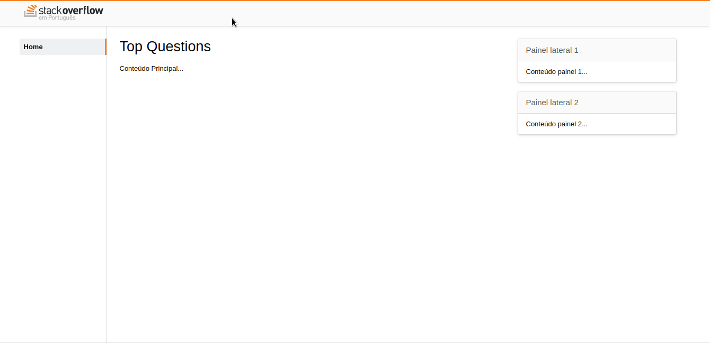

---

<div style="text-align: justify">

### Descrição
Um simples clone do layout da Stack Overflow desenvolvido em HTML5 e CSS3. Esse projeto foi desenvolvido durante o Bootcamp Desenvolvedor Front End da plataforma IGTI.

</div>

---

#### Link do Curso:

* [Matheus Battisti - Hora de Codar - Curso de Bootstrap](https://www.youtube.com/playlist?list=PLnDvRpP8Bnexu5wvxogy6N49_S5Xk8Cze)

Também tenho um repositório dedicado apenas a códigos e exercícios referente ao bootcamp. Para acessar basta clicar no link abaixo.

* [Acessar Repositório](https://github.com/ale-mouraboni/igti-frontend-bootcamp-study.git)

---

Esse projeto foi desenvolvido com as seguintes tecnologias:
* HTML5
* CSS3

---

Para ver o projeto você pode clonar ele com o seguinte comando:    

```sh
git clone https://github.com/ale-mouraboni/stack-overflow-layout-igti.git
```  
  
Você também pode baixar o arquivo .zip do projeto, basta clicar no botão abaixo.  
  
[Baixar Projeto](https://github.com/ale-mouraboni/stack-overflow-layout-igti/archive/refs/heads/main.zip)

---

### License
This project is under the MIT license. See the [LICENSE] for more information.

---
